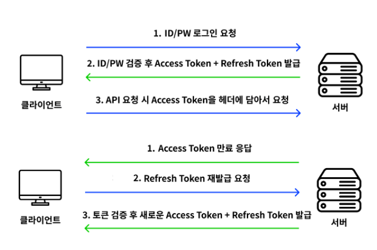

### 심플 로그인 프로젝트
<!-- TOC -->
    * [xss 공격방지 추가완료]
    * [csrf 공격방지 추가완료]
    * [jwt 방식 추가완료]
    * [이메일 인증 추가완료]
    * [Rate Limit 추가완료]
    * [Replication DB 추가중]
<!-- TOC -->

# master db (master-my.cnf)
[mysqld]  
server-id=1  
log-bin=mysql-bin  
gtid-mode=ON  
enforce-gtid-consistency=true

# slave db (slave-my.cnf)
[mysqld]  
server-id=2  
log-bin=mysql-bin  
gtid-mode=ON  
enforce-gtid-consistency=true

## Master에서 실행
CREATE USER 'replication_user'@'%' IDENTIFIED WITH 'mysql_native_password' BY 'replication_password';  
GRANT REPLICATION SLAVE ON \*.* TO 'replication_user'@'%';  
#특정 스키마만 적용하고 싶다면 아래의 내용으로 추가  
#GRANT SELECT ON `specific_schema`.* TO 'replication_user'@'%';  
FLUSH PRIVILEGES;  
FLUSH TABLES WITH READ LOCK;  

SHOW MASTER STATUS;  
+------------------+----------+--------------+------------------+-------------------+  
| File             | Position | Binlog_Do_DB | Binlog_Ignore_DB | Executed_Gtid_Set |  
+------------------+----------+--------------+------------------+-------------------+  
| mysql-bin.000001 | 123      | test         |                  |                   |  
+------------------+----------+--------------+------------------+-------------------+  
mysql-bin.000001 < Master에서의 파일  
123 < Master에서의 위치  

## Slave에서 실행
CHANGE MASTER TO  
MASTER_HOST='mysql-master',  
MASTER_PORT=3306,  
MASTER_USER='replication_user',  
MASTER_PASSWORD='replication_password',  
MASTER_AUTO_POSITION=1;

START SLAVE;

SHOW SLAVE STATUS;
