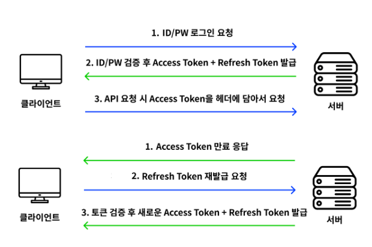
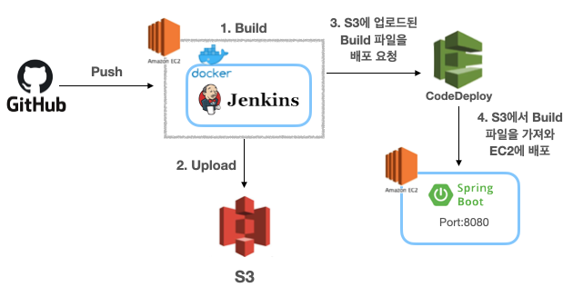

# 심플 로그인 프로젝트
<!-- TOC -->
    * [xss, csrf 공격방지 추가완료]
    * [JWT 방식 추가완료]
    * [CI/CD 방식 추가완료]
    * [이메일 인증 추가완료]
    * [Rate Limit 추가완료]
    * [Replication DB 추가완료]
    * [OAuth2 추가완료]
    * [다중언어 추가완료]
    * [boot 2 > 3 마이그레이션 완료]
<!-- TOC -->

## JWT 흐름도

## CI/CD 흐름도

## Docker 파일 실행
### Docker 실행
`service docker start`

### Compose 실행
docker-compose.yml이 존재하는 곳에서 아래의 명령어 입력   
`docker-compose up -d`

### Compose 이미지 모두 제거
`docker-compose down --volumes --rmi all`

## Master, Slave Replication 설정 방법 

### master db (master-my.cnf)
[mysqld]  
server-id=1  
log-bin=mysql-bin  
gtid-mode=ON  
enforce-gtid-consistency=true

### slave db (slave-my.cnf)
[mysqld]  
server-id=2  
log-bin=mysql-bin  
gtid-mode=ON  
enforce-gtid-consistency=true

### Docker DB 접속
`sudo docker exec -it jun-mysql-master-1 mysql -u root -p`     
`sudo docker exec -it jun-mysql-slave-1 mysql -u root -p`   

### Master에서 실행
`CREATE USER 'replication_user'@'%' IDENTIFIED WITH 'mysql_native_password' BY 'replication_password';`   
`GRANT REPLICATION SLAVE ON *.* TO 'replication_user'@'%';`

특정 스키마만 적용하고 싶다면 아래의 내용으로 추가   
`GRANT SELECT ON specific_schema.* TO 'replication_user'@'%';`     
`FLUSH PRIVILEGES;`   
`FLUSH TABLES WITH READ LOCK;`
`SHOW MASTER STATUS;`  
File : mysql-bin.000001 (이진 로그 파일. 변경 사항이 로그되는 바이너리 형식의 파일로, 데이터베이스의 변경 내용을 기록)        
Position : 123 (이진 로그 파일에서의 마지막 로그 항목의 위치를 나타낸다.)

### Slave에서 실행
`CHANGE MASTER TO
MASTER_HOST='mysql-master',
MASTER_PORT=3306,
MASTER_USER='replication_user',
MASTER_PASSWORD='replication_password',
MASTER_AUTO_POSITION=1;`

`START SLAVE;`   
`SHOW SLAVE STATUS;`

### 외부에서 접근할 유저 권한 생성
`create user '유저명'@'%' identified by '패스워드';`   
`grant all privileges on 스키마명.* to '유저명'@'%';`   
`FLUSH PRIVILEGES;`

### 동기화 에러시 백업 복구 방법
#### 1.mysqldump 
- Slave 에서  
`STOP SLAVE;`  
`RESET MASTER;`  
`RESET SLAVE ALL;`  

- 마스터 컨테이너에서 데이터베이스 덤프  
`docker exec -it jun-mysql-master-1 bash`  
`mysqldump -u root -p --all-databases --master-data > /tmp/master_backup.sql`  
`exit`

- 마스터 컨테이너에서 덤프 파일을 로컬로 복사  
`docker cp jun-mysql-master-1:/tmp/master_backup.sql ./master_backup.sql`  

- 로컬에서 슬레이브 컨테이너로 덤프 파일 복사  
`docker cp ./master_backup.sql jun-mysql-slave-1:/tmp/master_backup.sql`  

- 슬레이브 컨테이너에서 데이터베이스 복원  
`docker exec -it jun-mysql-slave-1 bash`  
`mysql -u root -p < /tmp/master_backup.sql`  
`exit`  
- 슬레이브 설정 재구성  
`CHANGE MASTER TO`  
`MASTER_HOST='mysql-master',`    
`MASTER_PORT=3306,`    
`MASTER_USER='replication_user',`  
`MASTER_PASSWORD='replication_password',`  
`MASTER_AUTO_POSITION=1;`  
`START SLAVE;`  
`SHOW SLAVE STATUS;`  

#### 2.특정 GTID 파악 및 제거
`SELECT * FROM performance_schema.replication_applier_status_by_worker;`  
`SHOW SLAVE STATUS;`  
`STOP SLAVE;`  
`SET GLOBAL GTID_PURGED="ddac1846-bb1b-11ee-a439-0242ac120002:9";`  
`START SLAVE;`  

#### 3. MASTER_AUTO_POSITION 꼬였을때 수동 설정
`SHOW MASTER STATUS;`  
`STOP SLAVE;`  
`CHANGE MASTER TO`    
`MASTER_LOG_FILE='mysql-bin.000021',`  
`MASTER_LOG_POS=7098129;`  
`START SLAVE;`  
